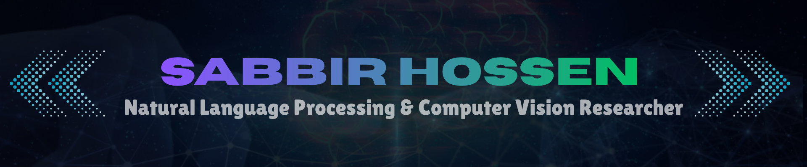

  

I am a recent Computer Science graduate from Bangladesh University with a strong foundation in Machine Learning, and I am currently working as a Research Assistant at at National Institute of Textile Engineering and Research. My research focuses on natural language processing, computer vision, and multimodal AI, with an emphasis on efficient models and low-resource language understanding. I aim to develop reliable, context-aware AI systems for resource-constrained settings.

  

  
  &nbsp;
  

<h3 align="center">Research Interests</h3>

  
  
  

  
  
  

<!--

<h3 align="center">🤝 Connect with Me</h3>

  
  
  
  
  

<h3 align="left">💻 Languages and Tools:</h3>

<h5 align="left">📚 Programming Languages:</h5>

  
  
  

<h5 align="left">📦 Python Libraries:</h5>

  
  
  
  

<h5 align="left">🧠 Machine Learning Framework:</h5>

  
  
  

